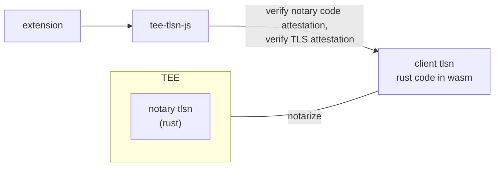

# Esper by Freysa

Esper by Freysa bridges the trust gap between humans and AI agents by enabling users to contribute verifiable web information. Using cryptography and secure hardware, users can create verifiable information that AI systems can rely on without compromising user privacy.
The Esper stack supports multiple applications, from contributing verified data to AI agents to proving credentials for access gating. One initial focus is on establishing digital personhood through a simple yet robust social proof system. This system uses cross-platform verification across four key platforms:

* Verify X followers
* Verify X subscription (pre GPT-4 release)
* Verify ChatGPT subscription
* Verify Reddit karma

As part of Freysa's mission to meaningfully interact with every human being on Earth, verified data and proof systems are fundamental to establishing genuine digital personhood.

## Codebase Overview

This protocol allows users to generate TLS attestations of any web data.

## Repo Structure

- [tee-tlsn](./tee-tlsn/README.md) - Rust implementation of TEE-TLSN protocol. Contains a client side and server side for the notary. Read the doc to deploy the notary server. This folder's code structure is forked from/inspired by the [TLSN](https://tlsnotary.org/) project.
- [tee-tlsn-js](./tee-tlsn-js/README.md) - Javascript wrapper of the WASM compiled rust code, to be used in the chrome extension.
- [chrome-extension](./chrome-extension/README.md) - The chrome extension captures user data and submits it securely to the notary.

## Browser Support
This extension is designed for Google Chrome only.

## Get Latest Extension Build

Go to repository page, then visit github actions and pick the latest successful run of workflow 'Github action build extension'. You'll find the extension .zip at the bottom of the page.
